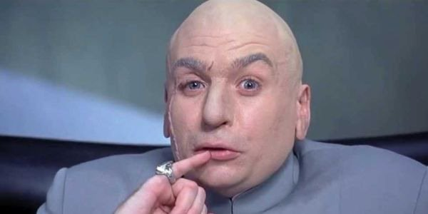

class: img-caption

# The problem of evil

---

class: img-center, fullbleed

---

class: img-center, fullbleed

---

“Something is dreadfully wrong with our world. An earthquake kills hundreds in Peru. A pancreatic cancer patient suffers prolonged, excruciating pain and dies. A pit bull attacks a two-year-old child, angrily ripping his flesh and killing him. Countless multitudes suffer the ravages of war in Somalia. A crazed cult leader pushes eighty-five people to their deaths in Waco, Texas. Millions starve and die in North Korea as famine ravages the land. Horrible things of all kinds happen in our world—and that has been the story since the dawn of civilization.”

&mdash;Michael Peterson, *God and Evil; An Introduction to the Issues*

---

class: img-right

# Theism

God exists and is

1. omnipotent
2. omniscient
3. perfectly good

---

class: img-right

# Theism

God exists and is

1. omnipotent (which **includes** omniscience)
2. perfectly good

???

- Antony treats **omniscience** as a power
- So as she uses the term, **omnipotence** entails **omniscience**

---

# The problem of evil

If God is **ominpotent**, **omniscient**, and **perfectly good**, then why is there so much **suffering** in the world?

---

# Logical argument from suffering

The existence of suffering **entails** that theism is false

- It is **absolutely impossible / inconceivable** for God and suffering to exist at the same time

 

--

# Evidential argument from suffering

The suffering we observe is **excellent evidence** that theism is false

---
class: img-right-full

# The logical argument from suffering

“Is [God] able, but not willing? Then he is malevolent. Is he willing, but not able? Then he is impotent. Is he both able and willing? Whence then, is evil?”

&mdash;David Hume

???

Hume is paraphrasing an argument made by the ancient Greek philosopher Epicurus

---

class: smaller

# The logical argument from suffering

1. No morally good being would allow suffering if he or she were able to prevent it ("No Tolerance")
2. An omnipotent being would always be able to prevent suffering.
3. SO, if there were a morally good, omnipotent being, there would be no suffering. (1, 2)
1. There is suffering.
2. SO, there is no being who is both morally good and omnipotent.

???

Louise Antony's version

---

class: smaller

# The logical argument from suffering

1. **No morally good being would allow suffering if he or she were able to prevent it ("No Tolerance")**
2. An omnipotent being would always be able to prevent suffering.
3. SO, if there were a morally good, omnipotent being, there would be no suffering. (1, 2)
4. There is suffering.
5. SO, there is no being who is both morally good and omnipotent. (3, 4)

???

Antony: the principle of no tolerance is false

- Why does she think it's false?

---

# Parent and Child

"A loving parent (who we will call 'Parent') follows the guidance of child-care experts and disciplines his child ("Child") by allowing her to experience the 'natural consequences' of her actions. On one occasion, Child leaves a favorite toy outside overnight, ignoring Parent's warning that doing so might result in damage to the toy."

???

- Is it wrong for Parent to allow Child to suffer in order to teach her a valuable lesson?

- What's the point of the story supposed to be?

---

# Objection to No Tolerance

No morally good being would allow suffering if he or she were able to prevent it ("No Tolerance")

- **False**, because good people sometimes have **good reasons** to allow others to suffer

???

So the No Tolerance principle needs to be revised

--

## No Tolerance Unless

No morally good being would allow suffering if he or she were able to prevent it **unless** he or she had a **good reason** to permit it

---

class: smaller

# The logical argument from suffering (v2)

1. No morally good being would allow suffering if he or she were able to prevent it unless he or she had a good reason to permit it ("No Tolerance Unless")
2. An omnipotent being would always be able to prevent suffering.

???

---

class: smaller

# The logical argument from suffering (v2)

1. No morally good being would allow suffering if he or she were able to prevent it unless he or she had a good reason to permit it ("No Tolerance Unless")
2. An omnipotent being would always be able to prevent suffering.
3. There is no good reason that a morally good, omnipotent being could have to allow suffering ("No Good Reason")
4. SO, if there were a morally good, omnipotent being, there would be no suffering. (1, 2, 3)

???

---

class: smaller

# The logical argument from suffering (v2)

1. No morally good being would allow suffering if he or she were able to prevent it unless he or she had a good reason to permit it ("No Tolerance Unless")
2. An omnipotent being would always be able to prevent suffering.
3. There is no good reason that a morally good, omnipotent being could have to allow suffering ("No Good Reason")
4. SO, if there were a morally good, omnipotent being, there would be no suffering. (1, 2, 3)
5. There is suffering.
6. SO, there is no being who is both morally good and omnipotent. (4, 5)

???

---

class: smaller

# The logical argument from suffering (v2)

1. No morally good being would allow suffering if he or she were able to prevent it unless he or she had a good reason to permit it ("No Tolerance Unless")
2. An omnipotent being would always be able to prevent suffering.
3. **There is no good reason that a morally good, omnipotent being could have to allow suffering ("No Good Reason")**
4. SO, if there were a morally good, omnipotent being, there would be no suffering. (1, 2, 3)
5. There is suffering.
6. SO, there is no being who is both morally good and omnipotent. (4, 5)

???

Antony thinks that there is a problem with the principle of No Good Reason. What is it?

---

# Logical argument from suffering

The existence of suffering **entails** that theism is false

- It is **absolutely impossible / inconceivable** for God and suffering to exist at the same time

 

# Evidential argument from suffering

The suffering we observe is **excellent evidence** that theism is false

???

Recall what the logical argument from suffering was supposed to achieve

- The logical argument from suffering was supposed to show that the view that God and suffering both exists is **incoherent**
- But Antony thinks that the revised version doesn't do that

---

# Objection

There is no good reason that a morally good, omnipotent being could have to allow suffering ("No Good Reason")

- This is **plausible**, but isn't **obviously** true
- It's **conceivable** that God has a good reason to allow suffering that we haven't thought of yet
- So it's conceivable that God and suffering could coexist

---

class: smaller

# The logical argument from suffering (v2)

1. No morally good being would allow suffering if he or she were able to prevent it unless he or she had a good reason to permit it ("No Tolerance Unless")
2. An omnipotent being would always be able to prevent suffering.
3. **There is no good reason that a morally good, omnipotent being could have to allow suffering ("No Good Reason")**
4. So, if there were a morally good, omnipotent being, there would be no suffering. (1, 2, 3)
5. There is suffering.
6. So, there is no being who is both morally good and omnipotent. (4, 5)

???

**Antony:** even if this argument is sound, it doesn't show that God and suffering **could not possibly** coexist

---

"[The atheist] can't show that the existence of suffering **proves** that there is no God, but perhaps she can show that the existence of suffering provides very good **evidence** that there is no God"

"She cannot say that the principle No Good Reason is **certainly** true, but perhaps she can give grounds for thinking that it is **very probably** true"

---

# No Good Reason

## Version 1

There is no good reason that a morally good, omnipotent being could have to allow suffering

## Version 2

**Probably,** there is no good reason that a morally good, omnipotent being could have to allow suffering

---

class: smaller

# Evidential argument from suffering

1. No morally good being would allow suffering if he or she were able to prevent it unless he or she had a good reason to permit it ("No Tolerance Unless")
2. An omnipotent being would always be able to prevent suffering.
3. **Probably,** there is no good reason that a morally good, omnipotent being could have to allow suffering ("No Good Reason")
4. So, if there were a morally good, omnipotent being, then **probably** there would be no suffering. (1, 2, 3)
5. There is suffering.
6. So, **probably** there is no being who is both morally good and omnipotent. (4, 5)

???

Antony: to evaluate this argument, we need to start by asking what it is for someone to have a "good reason" to allow suffering

---

class: standout

# What makes a reason for allowing suffering a GOOD reason?

???

Antony proposes a few conditions -- what are they?

---

# Good reasons to allow suffering

???

Antony says that three conditions need to be satisfied

--

1. The suffering is allowed for the sake of a **morally laudable goal**

???

Part of what makes Parent's decision to allow Child to suffer is that Parent is pursuing a morally important goal -- teaching the child a valuable lesson

--

1. The goal is **sufficiently important** to justify allowing the suffering

???

If Parent's goal was less important -- say, Parent wanted to keep talking to his spouse -- then we would judge Parent harshly

--

1. Allowing the suffering to achieve the goal is **fair**

???

If Parent was allowing Child to suffer for the benefit of Child's siblings, then that would be unfair -- and so wouldn't count as a good reason

---

# Good reasons to allow suffering

1. The suffering is allowed for the sake of a **morally laudable goal**
1. The goal is **sufficiently important** to justify allowing the suffering
1. Allowing the suffering to achieve the goal is **fair**

---

class: standout

# What reasons might a benevolent, omnipotent God have to allow the suffering we observe?

---

# No Good Reason

**Probably,** there is no good reason that a morally good, omnipotent being could have to allow suffering ("No Good Reason")

- God does not have the limitations Parent has
- Why couldn't God give us the good things suffering brings without the suffering?

???

---

# The Free Will defense

**Probably,** there is no good reason that a morally good, omnipotent being could have to allow suffering ("No Good Reason")

Two claims:

- Free will has **surpassing moral value**&mdash;enough to outweigh the suffering we observe
- Suffering is an **inevitable consequence** of allowing us to exercise free will

--

Could free will be a good reason for God to allow **human suffering**?

---

class: img-right

# The problem of animal suffering

What possible good reason could there be for God to allow **animal suffering**?

---

class: smaller

# Evidential argument from suffering

1. No morally good being would allow suffering if he or she were able to prevent it unless he or she had a good reason to permit it ("No Tolerance Unless")
2. An omnipotent being would always be able to prevent suffering.
3. **Probably,** there is no good reason that a morally good, omnipotent being could have to allow suffering ("No Good Reason")
4. So, if there were a morally good, omnipotent being, then **probably** there would be no suffering. (1, 2, 3)
5. There is suffering.
6. So, **probably** there is no being who is both morally good and omnipotent. (4, 5)

???

Antony: God **could** have a good reason to allow suffering, but that seems very **unlikely**
