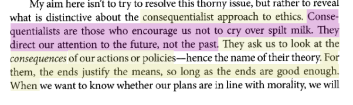

# Marlee

I think this definition is a little too broad. What if what is morally required includes self-sacrifice or sacrificing the feelings of innocent others? What if what is best still harms a significant group? The way I interpret this, consequentialism requires direct action despite these things.

# Ian Carter on moral relativism

This is an interesting claim. I think this idea would be perfect if there was a universal truth about which actions are considered more/less good than others, but there is not. The fact that we all perceive the world differently complicates this approach. For example, If we were faced with saving a child or a social worker, which choice would "morally right"? The child is innocent, and has a future with unlimited potential to bring goodness to the world (but currently contributes little goodness). The social worker is actively contributing goodness to the world (but her work will likely be the full extent of her contribution of goodness to the world). Who should be saved? Perhaps a different philosophy should guide us.

# Natalie Noble on the decision procedure

In response to SL saying it won't always be easy in practice to follow the decision procedure

I believe this is understated- we're generally terrible at objectively weighing consequences and removing ourselves from a moral decision. As simplistic as these steps sound ("Just figure out which decision has the best ratio of good to bad!"), this is near impossible for anyone to do in real life, because we have our own bias and desires clouding these evaluations.

# Zach Stanford on the consequentialist decision procedure

"I find this process to be pretty interesting. Looking at it written out on paper, it seems like a process that would be difficult to follow on the fly. While the steps themselves seem straightforward enough, an individual might not always have the liberty of identifying every possible option and associating value with each of those options. There could be scenarios in which the individual must make a quick decision with no time to spare. In that case, is picking the best thing you could come up with in line with consequentialism? Has that person made an immoral decision even though they did not have time to consider all of their options? The same thing could be said about individuals who did not have knowledge of the consequential best decision. Is their action the optimific choice if that is the best decision they could come up with (even though better decisions existed)? From what I understand, picking the best decision that you could think of out of all of the options you could think of is the consequentialist way."

# Sam Mayuski on consequentialism and moral rules

Does consequentialism in this context entail ignoring ethical standards when making a decision? Is it solely based off of which policy yields the greatest benefit to a certain population? If that is the case, how does one decide which people are to benefit from "optimific" decisions like this? Surely there are ethical drawbacks in some cases too significant to ignore.

# Jake smith on consequentialism and heinous acts

I think this makes sense; However, I can see how this philosophy could go wrong. In the past, people believed a utopian society was possible and that any means were justified to reach it. This caused people to commit terrible acts in the pursuit of an impossible goal. Some examples of this are the soviet union and Maoist China.

# On consequentialism and spilled milk

This description of consequentialism left me a bit confused. Working with the example that was given, does this mean that a consequentialist cannot factor in the relief that it would bring the families of the victim when trying to determine if capital punishment is just since this is looking backwards? This seems like a major shortcoming of the ideology if this is the case.

## A problem from last week

It's impossible to predict with any confidence what the long-run consequences of any given action will be

So we are rarely (if ever) in a position to know what we ought to do, if utilitarianism is true!

???
J.S. Mill, writing in the 1860s, was aware of this problem

Here's what he had to say about it

---

## Mill's solution to both problems

"Defenders of utility often find themselves called upon to reply to such objections as this&mdash;that there is not time, previous to action, for calculating and weighing the effects of any line of conduct on the general happiness."

--

"The answer to the objection is, that there has been ample time, namely, the whole past duration of the human species. During all that time, mankind have been learning by experience the tendencies of actions; on which experience all the prudence, as well as all the morality of life, are dependent."

???
So the idea here is that, most of the time, we should follow commonsense moral rules such as "do not steal" and "do not kill"

**Q** what do you think Mill would say about the Island Doctor case?

---

## Moral principles

**Moral principle** = a claim about what we ought to do in a fairly wide range of cases

Examples:

- We always ought to perform the action available to us that would produce the most well-being (the principle of utility)
- We ought not to harm innocent people (the principle of non-maleficence)

???
We can put the general point Mill is making more precisely in terms of the idea of a moral principle

---

class: sectiontitle

# Moral standards and moral guides

---

## Moral standards vs. moral guides

Two kinds of moral principles:

1. **Moral standards** specify conditions under which actions are morally required, permitted, or prohibited
2. **Moral guides** offer guidance to agents about how to determine whether an action is morally required, permitted, or prohibited

---

## Moral standards vs. moral guides

The principle of utility is a moral standard, not a moral guide

Using the principle of utility as a moral guide would be

-  **impossible** most of the time
-  **disastrous** (e.g., the Tuskegee syphillis experiment)

---

## Mill's harm principle

"The only purpose for which power can be rightfully exercised over any member of a civilized community, against his will, is to prevent harm to others'' (On Liberty)"

???
In fact, Mill thought that we should be extremely cautious about interfering with other people's lives in an attempt to maximize wellbeing for the broader society

Here's a moral guide that Mill argues for in his book On Liberty, which had a huge impact on the development of democratic political theory

Mill makes clear that by "harm" here, he means the immediate threat of physical harm. For example, Mill thought that you should almost never interfere with the speech of others, even if you think the views that they are spreading are very dangerous. So he thought that you needed an extremely strong case in order to justify coercively interfering with others

We'll come back to this next week when we talk about autonomy and free speech

---

## Broad agreement in practice but not theory

Ethical theories endorse **different moral standards**
    
However, in practice they tend to accept many of the **same moral guides**

- Broad agreement about what moral goals and constraints should guide our behavior

???
More generally, while it might initially seem like ethicists don't agree about very much, it turns out that there is actually broad agreement about what we ought to do in particular cases

---

## Broad agreement in practice but not theory

"From a prudential point of view, some people’s lives may not matter to us, particularly if they are too weak or distant to either harm or benefit us. &hellip; But from a moral point of view, all people matter in and of themselves. It matters how well their lives go, and if our decisions affect their wellbeing, then we must take that into account. Adopting the moral point of view, therefore, requires that we sympathetically attend to people’s interests and circumstances, try to understand how things look from their point of view, and give due weight to their wellbeing.''

???
Here's how Will Kymlicka puts the point

---

## How do we figure out what we ought to do?

Proposal:

1.  Identify **stakeholders** and relevant **stakeholder interests**
2.  Consider how different **options** would affect those interests
3.  Attempt to **balance competing interests** impartially

---

## Values identified in AI4People

1. **Beneficence.** Will the system benefit others?
2. **Non-maleficence.** Will it harm anyone?
3. **Autonomy.** Will it interfere with self-governance?
4. **Privacy.** Will it use private information without consent?
5. **Justice.** Will it treat people fairly? Will it promote or undermine just social institutions?
6. **Transparency.** Can we understand why the system acts as it does?
7. **Responsibility.** Will we be able to hold someone accountable if things go wrong?

???

Last week we talked about different moral values that seem relevant to the design of AI-based systems

- These values correspond to different kinds of interests stakeholders have
- For the rest of the class we'll be talking about non-maleficence