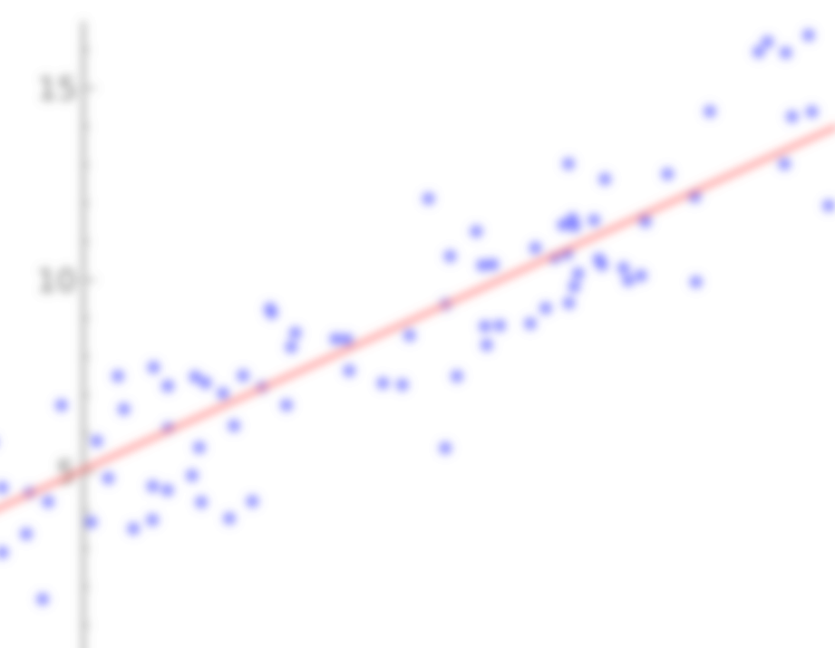
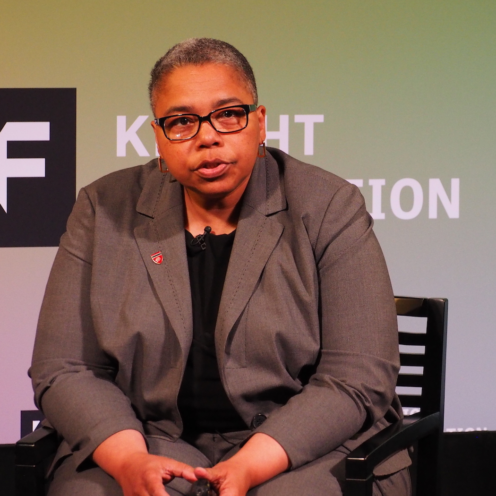
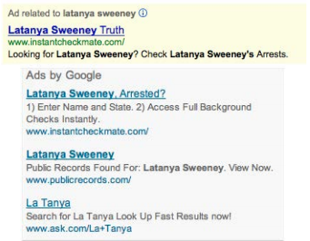
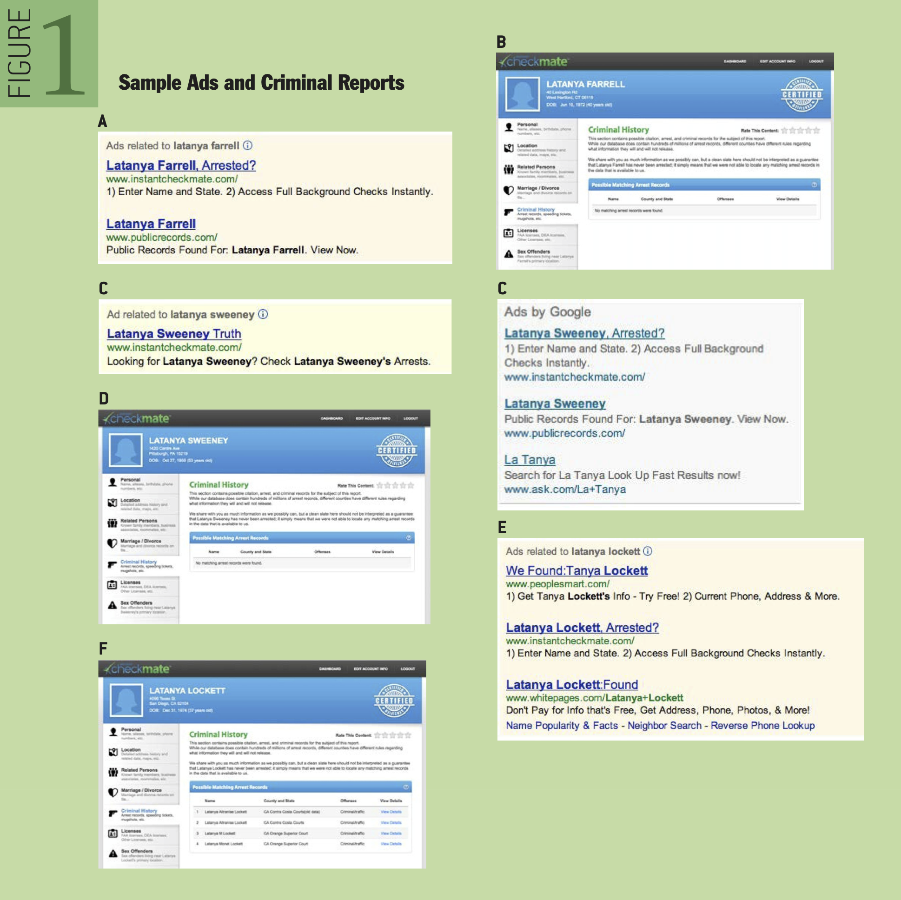
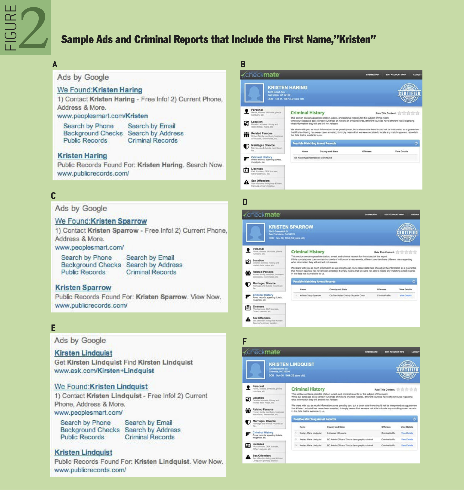
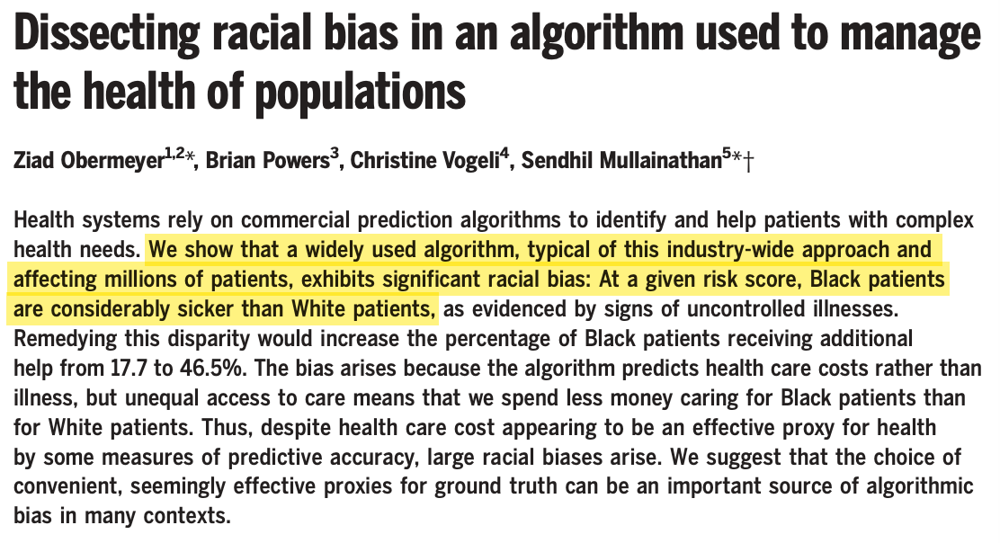
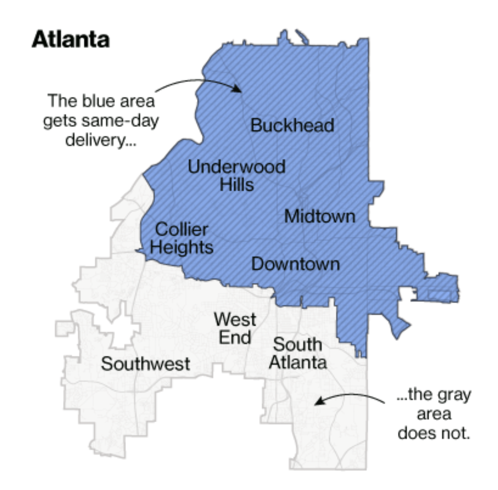

class: img-caption

# L22 Algorithmic Discrimination

---

background-image: url(xkcd-background.png)

Institutions increasingly use **predictive algorithms** to allocate **important benefits and burdens**

???

Institutions increasingly rely on predictive algorithms to make high-stakes decisions about how to treat particular individuals

- Financial institutions have been using statistical models to predict the likelihood that a loan applicant will default for many years. But more recently, the practice has been extended to a wide variety of domains
- Employers use predictive algorithm to predict a candidate's future job performance
- Courts use them to predict the likelihood that defendants will commit crimes if they are released on bail
- Hospitals use them to predict which patients will become gravely ill so that they can treat them more aggressively

---

background-image: url(xkcd-background.png)

Institutions increasingly use **predictive algorithms** to allocate **important benefits and burdens**

-   Feature of individuals basis for unequal treatment
-   Need to predict whether feature is present
-   Train predictive algorithm on historical data

???

In each of these cases, there's some feature of individuals that is taken to be a justification for allocating some burden or benefit -- such as whether they are likely to repay a loan

-   And the institution wants to determine how likely it is that particular individuals have that feature, given the evidence available
-   To do that, they take data about how other individuals have behaved in the past -- such as people who were previously granted loans -- and they train a predictive algorithm on that data

The practice of using predictive algorithms to allocate important benefits and burdens raises a wide variety of ethical concerns, including concerns about discrimination, privacy, transparency, due process, and accountability

- Today I'm going to be talking about a subset of these concerns -- concerns about wrongful discrimination -- and a possible solution to them that has been developed by computer scientists -- statistical criteria of fairness

---

background-image: url(xkcd-background.png)

## Algorithmic discrimination

**Wrongful discrimination** resulting from the use of a **predictive algorithm** to decide how to treat individuals

???

A growing body of evidence shows that the predictive algorithms institutions use to make decisions can be unfairly biased against members of socially marginalized groups. 

-   This phenomenon is often called "algorithmic discrimination"

---

class: center, fullbleed

???

Latanya Sweeney found something interesting when she Googled her own name

---

class: center, fullbleed

???

This struck her as suspicious. Why was she getting an ad like this, despite not having an arrest record?

So she Googled some other names.

---

class: center, fullbleed

???

Some other names, like Latanya Farrell, also brought up an Instant Checkmate ad that suggested wrongly that the person had an arrest record.

---

class: center, fullbleed

???

But other names didn't. She thought she noticed a pattern - searching for names that are more associated with black people than white people seemed to be more likely to return an Instant Checkmate ad

So she devised an experiment, and searched for the names of 2184 real people on google.com and reuters.com

---

class: img-right

## Instant Checkmate 

On Google, "**black-identifying names** turned out to be **much more likely than white-identifying names** to generate ads that including the word “arrest” (60 per cent versus 48 per cent)" (*MIT Tech Review*)

- High level of statistical significance (p < 0.1)
- Not explained by differences in arrest records

---

class: img-right

## Instant Checkmate 

On reuters.com, "a black-identifying name was **25% more likely** to get
an ad suggestive of an arrest record"

-   High level of statistical significance (p < 0.001)
-   Not explained by differences in arrest records

---

background-image: url(amazon-bkg.png)

## Amazon's hiring system

???

In 2017, Amazon was forced to mothball a machine learning system its recruiters had been using to evaluate candidates after discovering that it had learned to downgrade candidates who attended women’s colleges or played on women’s sports teams. (The system had been trained on past hiring data, and that data reflected hiring manager’s biases against women candidates.) They didn’t discover the problem until well into development, and after the system had already been provided to recruiters making hiring decisions.

---

## Care management enrollment 

"A single algorithm drives an important health care decision for over 70 million people in the US. When health systems anticipate that a patient will have especially complex and intensive future health care needs, she is enrolled in a 'care management' program, which provides considerable additional resources: greater attention from trained providers and help with coordination of her care. To determine which patients will have complex future health care needs, and thus benefit from program enrollment, many systems rely on an algorithmically generated commercial risk score."

---

???

Obermeyer et al recently found that the algorithm appears to be biased against Black patients.

[read quote from beginning]

---

## Amazon Prime Same-Day Delivery

"In cities where the service is available, Amazon offers Prime members same-day delivery of more than a million products for no extra fee on orders over $35. Eleven months after it started, the service includes 27 metropolitan areas. In most of them, it provides broad coverage within the city limits. Take Amazon’s home town of Seattle, where every ZIP code within the city limits is eligible for same-day delivery and coverage extends well into the surrounding suburbs."

---

class: center, fullbleed

---

class: center, fullbleed

---

# Amazon Prime Same-Day Delivery

"In six major same-day delivery cities ... **the service area excludes predominantly black ZIP codes to varying degrees**, according to a Bloomberg analysis that compared Amazon same-day delivery areas with U.S. Census Bureau data.

In Atlanta, Chicago, Dallas, and Washington, cities still struggling to overcome generations of racial segregation and economic inequality, **black citizens are about half as likely** to live in neighborhoods with access to Amazon same-day delivery as white residents."

---

class: sectiontitle

# What is wrongful discrimination?

---

## Wrongful discrimination

A decision procedure **wrongfully discriminates** against social group *x*
if and only if:

1.  there is a **social group** *y* such that the procedure treats the
    members of *x* **less favorably** than the members of *y*;
2.  part of the **explanation** for the difference in treatment is their
    membership in *x* and *y*, respectively; and
3.  the difference in treatment is **not morally justified**.

---

## Are these discrimination?

1.  A school runs a lottery for tickets to the school play, and men
    receive 75% of the tickets (completely by chance)
2.  A hospital has a policy of scheduling women over 40 for annual
    mammograms, but not men or women under 40

---

## Wrongful and discrimination, but not wrongful discrimination

Suppose a teacher lines up students whose names begin with the letters A-G on one side of the room, and students whose names begin with the letters H-Z on the other. The student then ridicules the first group of students but not the second.

--

- This is **wrongful**
- And it's **discrimination** = treating some people differently than others because they have different features
- But it's not **wrongful discrimination**

???

Why not? 

- Students whose names start with A-G don't constitute a social group in the relevant sense
- To form a social group in the relevant sense, they need to be treated as a group by the society in general for a wide variety of purposes

---

## Direct and indirect discrimination 

**Direct discrimination** = wrongful discrimination resulting from a negative attitude toward the social group

**Indirect discrimination** = wrongful discrimination that does not result from such an attitude

---

## Direct discrimination

**Direct discrimination** = wrongful discrimination resulting from a negative attitude toward the social group (e.g. animus or indifference)

- **Animus:** e.g., a hiring manager that prefers not to hire Black applicants
- **Negligence:** a hiring manager that reads applications from Black applicants less carefully before rejecting them

---

## Indirect discrimination

**Indirect discrimination** = wrongful discrimination that does not result from a negative attitude toward the social group (e.g. animus or indifference).

* **Candidate example:** requiring a high school diploma for a job that really does not require it, in light of the fact that Black Americans are significantly less likely to have a high school diploma (89%) than white Americans (79%)

???

https://www.brookings.edu/blog/up-front/2021/01/12/the-unreported-gender-gap-in-high-school-graduation-rates/

---

## Why is wrongful discrimination wrong?

1. Failing to **treat similar people similarly**
2. Reinforcing **structural discrimination** without adequate justification

---

## Failing to treat similar people similarly

**The Aristotelian conception of fairness:** treating people fairly requires treating similar people similarly

- I.e., fairness requires that people who are **similar in all morally relevant respects** be treated in **similarly favorable ways**
- **Example:** declining a mortgage applicant from a Black applicant, when you would have approved the application had the applicant been White

---

## Reinforcing structural discrimination

**Structural discrimination** = "When the rules of a society’s major institutions reliably produce disproportionately disadvantageous outcomes for the members of certain salient social groups and the production of such outcomes is unjust, then there is structural discrimination against the members of the groups in question, apart from any direct discrimination in which the collective or individual agents of the society might engage" (SEP, "Discrimination")

**Candidate example:** requiring a high school diploma for a job that really does not require it, in light of the fact that Black Americans are significantly less likely to have a high school diploma (89%) than White Americans (79%)

---

## Why is wrongful discrimination wrong?

**Direct discrimination:** making decisions in a way that (1) treats member of the group less favorably than you would treat others who are similar in all morally relevant respects, and so (2) failing to treat similar people similarly

**Indirect discrimination:** making decisions in a way that (1) leads to poorer outcomes for members of the group than others (2) without an adequate moral justification for doing so, and so (3) unnecessarily reinforcing structural discrimination 

---

class: sectiontitle

# Algorithmic discrimination

---

background-image: url(xkcd-background.png)

## Algorithmic discrimination

**Wrongful discrimination** resulting from the use of a **predictive algorithm** to decide how to treat individuals

???

We've seen four examples where relying on an algorithm results in members of one social group being treated less favorably than another:

1. Amazon's hiring system
2. Care management triage algorithm
3. Amazon Prime Same-Day delivery
4. Instant Checkmate

For each example, we'll:

1. Consider why members of one social group are being treated less favorably than another
2. Ask whether it's a genuine example of wrongful discrimination, and if so, why

---

background-image: url(amazon-bkg.png)

## Amazon's hiring system

---

## Amazon's hiring system

Why did the system tend to penalize applications from women?

- The model was trained on **data from past hiring managers**, who tended to rate women less favorably than similarly qualified men
- Women's resumes are **more likely to include the word "women's"** e.g. "women's soccer"
- Women's resumes are **less likely to include martial language** like "execute"

---

## Amazon's hiring system

1. Would using the system result in (a) failing to treat similar people similarly or (b) reinforcing structural discrimination without adequate justification?
2. Would using the system constitute (a) direct discrimination, (b) indirect discrimination, or (c) neither?

???

---

## Care management enrollment 

Obermeyer et al. analyzed data from a large hospital and found that:

-   Black patients with a given risk score tended to be **significantly
    sicker** than white patients
-   As a result, black patients were **much less likely to be enrolled**
    than equally sick white patients

---

## Care management enrollment

Why was this happening?

- The designers of the system used **expected consumption** of health care resources as a proxy for **expected need** for health care resources
- Black Americans consume fewer health care resources than similarly sick white Americans

---

## Care management enrollment

1. Would using the system result in (a) failing to treat similar people similarly or (b) reinforcing structural discrimination without adequate justification?
2. Would using the system constitute (a) direct discrimination, (b) indirect discrimination, or (c) neither?

---

class: center, fullbleed

---

class: img-right

## Amazon Prime delivery

Why was this happening?

- Black Americans are **less likely to be Amazon Prime subscribers** than white Americans
- Amazon decides whether to offer Same-Day delivery to a zip code **based on how many subscribers** live in the area

---

class: img-right

## Amazon Prime delivery

1. Would using the system result in (a) failing to treat similar people similarly or (b) reinforcing structural discrimination without adequate justification?
2. Would using the system constitute (a) direct discrimination, (b) indirect discrimination, or (c) neither?

---

class: img-right

## Instant Checkmate 

On reuters.com, "a black-identifying name was **25% more likely** to get
an ad suggestive of an arrest record"

-   High level of statistical significance (p < 0.001)
-   Not explained by differences in arrest records

---

## Instant Checkmate

Why was this happening?

Sweeney's hypotheses:

1. **Instant Checkmate** deliberately targeted people with black-identifying names
2. **Google** targeted deliberatelypeople with black-identifying names
3. **Users** were more likely to click on ads if they were associated with a black-identifying name, and **Google's algorithms** "learned" the pattern

---

## Instant Checkmate

1. Would using the system result in (a) failing to treat similar people similarly or (b) reinforcing structural discrimination without adequate justification?
2. Would using the system constitute (a) direct discrimination, (b) indirect discrimination, or (c) neither?